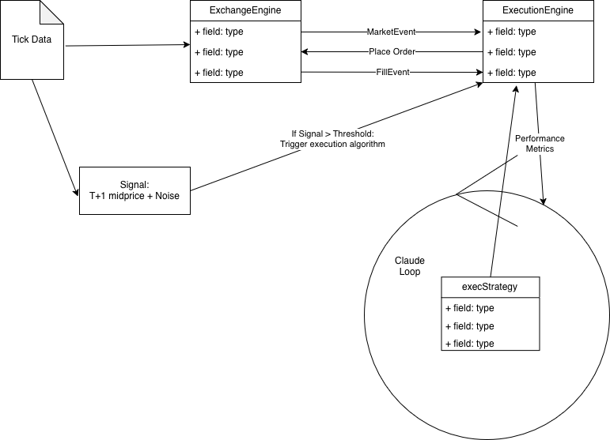

# Agentic Trading System

Created for Event Horizon Labs as a part of the University of Chicago Project Lab, Spring 2026

## Overview

This repository provides an iterative feedback loop for autonomous agents to research, develop, and implement trading strategies. Our goal is to create a verifiable environment where agents can autonomously iterate and improve upon trading strategies.

## System Architecture

The following diagram illustrates how the Agentic System interacts with the Exchange and Execution engines to create the strategy feedback loop:


## Features

### Automated Strategy Snapshot System

The repository includes a sophisticated snapshot system that automatically backs up trading strategies to AWS S3:

- **Automated Backups**: Snapshots are created automatically when pushing to `snapshots/*` branches
- **Manual Triggers**: Create snapshots on-demand via GitHub Actions
- **Comprehensive Storage**: Each snapshot includes code, backtesting results, and metadata
- **30-Day Retention**: Automatic cleanup prevents storage bloat
- **Secure & Reliable**: Stored in AWS S3, separate from git repository to prevent data loss

### What Gets Snapshotted?

- Strategy code (.py files, Jupyter notebooks)
- Backtesting results (JSON, CSV, visualizations)
- Performance metrics (returns, Sharpe ratio, drawdown, win rate)
- Metadata (timestamps, commit SHAs, workflow info)

## Documentation

- **[SKILLS.md](./SKILLS.md)** - Complete guide for agents on how to create and manage snapshots
- **[AWS Setup Guide](./docs/AWS_SETUP_GUIDE.md)** - Step-by-step AWS infrastructure setup
- **[Implementation Plan](./docs/IMPLEMENTATION_PLAN.md)** - System architecture and design decisions

## Repository Structure

```
agentic-trading-system/
├── execution_algos/                 # Reusable execution algorithm module
│   └── simple_execution_strategy/
│       └── execution_algorithm.py
├── strategies/                      # Trading strategy implementations
│   └── sample_momentum_strategy/    # Example strategy with results
│       ├── momentum_strategy.py     # Strategy code
│       ├── requirements.txt         # Dependencies
│       └── results/                 # Backtesting results
│           ├── backtest-results.json
│           └── trade-history.csv
├── .github/
│   └── workflows/
│       └── snapshot-strategy.yml    # Automated snapshot workflow
├── docs/
│   ├── AWS_SETUP_GUIDE.md          # Infrastructure setup
│   └── IMPLEMENTATION_PLAN.md       # System design
├── SKILLS.md                        # Agent instructions for snapshots
└── README.md                        # This file
```

## Quick Start for Agents

### Create a Strategy Snapshot

**Method 1: Automatic (Recommended)**

```bash
# Create snapshot branch
git checkout -b snapshots/your-strategy-name

# Add your strategy
mkdir -p strategies/your-strategy-name/results
# ... add your code and results ...

# Push to trigger automatic snapshot
git add strategies/your-strategy-name/
git commit -m "Add trading strategy with backtest results"
git push origin snapshots/your-strategy-name
```

**Method 2: Manual**

1. Go to GitHub → Actions → "Create Strategy Snapshot"
2. Click "Run workflow"
3. Enter strategy name and path
4. Click "Run workflow" button

See [SKILLS.md](./SKILLS.md) for detailed instructions.

## Snapshot Storage Structure

Snapshots are stored in S3 with this structure:

```
s3://bucket-name/strategies/
└── strategy-name/
    └── 2026-04-04T12-30-45Z-abc1234/    # Timestamp + commit SHA
        ├── code/
        │   ├── strategy.py
        │   └── requirements.txt
        ├── results/
        │   ├── backtest-results.json
        │   └── trade-history.csv
        └── metadata.json                 # Snapshot metadata
```

## Setup

For administrators setting up the infrastructure:

1. Follow the [AWS Setup Guide](./docs/AWS_SETUP_GUIDE.md) to configure:
   - AWS account and S3 bucket
   - IAM user with minimal permissions
   - GitHub repository secrets
   - Lifecycle policies for retention

2. The GitHub Actions workflow is pre-configured and ready to use

3. Share the [SKILLS.md](./SKILLS.md) guide with autonomous agents

## Example Strategy

A sample momentum trading strategy is included in `strategies/sample_momentum_strategy/` to demonstrate:

- Strategy code structure
- Backtesting results format
- How snapshots capture everything

## Security

- AWS credentials stored securely in GitHub Secrets
- IAM user has minimal permissions (PutObject, GetObject only)
- S3 bucket is private with no public access
- Lifecycle policies automatically expire old snapshots

## Cost Estimate

Expected monthly costs for moderate usage:
- S3 Storage (10-100GB): ~$2-5
- API requests: ~$0.01
- **Total: $3-10/month**

Well within the $10-50/month budget range.

## Future Enhancements

- Snapshot retrieval workflow (download via GitHub Actions)
- Performance comparison dashboard
- Automated strategy validation
- Multi-cloud backup support

## Contributing

This repository is designed for autonomous agents to iterate on trading strategies. Agents should:

1. Develop strategies in the `strategies/` directory
2. Develop execution algorithms in the `execution_algos/` directory
3. Include comprehensive backtesting results
4. Use the snapshot system to preserve iterations
5. Follow naming conventions in SKILLS.md

## License

Created for Event Horizon Labs - University of Chicago Project Lab

---

**Snapshot Retention:** 30 days  
**Last Updated:** 2026-04-04
